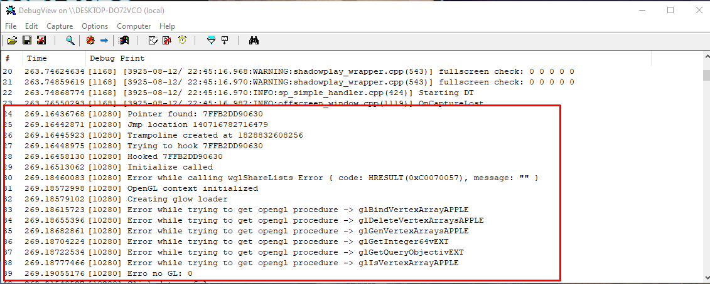

# OpenGL 1.0 Detour + eGUI Injection (Windows)

## Overview

This is a **lab project** that demonstrates how to perform **function detouring** on **OpenGL 1.0** in Windows using **Rust `unsafe`** code and **inline assembly** in an almost bytecode-like style.  
The goal is to hook low-level OpenGL calls and **inject an [`egui`](https://github.com/emilk/egui) UI** into an existing rendering pipeline.

This is a **highly low-level**, **unsafe**, and **Windows-specific** example intended for educational and research purposes only.  
It is **not maintained**, **not production-ready**, and should be treated solely as a reference for building other projects.

---

## Complexity and Expertise Required

This project involves **advanced low-level programming** concepts that require deep understanding in:

- Operating system internals and Windows API.
- CPU architecture and instruction sets (x86/x86_64) for inline assembly.
- Manual function hooking and trampolining techniques.
- Unsafe Rust programming with direct memory manipulation.
- OpenGL context management and graphics pipeline intricacies.
- DLL injection and process memory layout.

The code is **not polished or clean**; it is intentionally written at a very low level because the goal is **not maintenance**, but to provide a **Rust-based example** for educational purposes.

The amount of subtle pitfalls is enormous. A single misplaced byte in the trampoline or a mismanaged OpenGL context can cause **immediate crashes** or undefined behavior.  

This project is **not trivial**—it demands **background in systems programming** and some experience with **unsafe code and debugging injected code inside other processes**.

---

## Features

- Manual detouring of OpenGL 1.0 functions (e.g. `wglSwapBuffers`) without relying on external hooking libraries.
- Direct memory patching using Rust's `unsafe` capabilities.
- Inline assembly for precise instruction patching.
- `egui` integration rendered on top of the hooked OpenGL context.

---

## How It Works

1. **Injection into the target application**  
   The project is compiled as a DLL and injected into a target process

2. **Function detouring**  
   The entry point of a target OpenGL function (like `wglSwapBuffers`) is overwritten with a jump to our custom handler using inline assembly.

3. **UI rendering**  
   Inside the hooked function, the original OpenGL rendering is preserved, and an `egui` render pass is injected before returning control to the application.

---

## Project Status

- **Unmaintained**: This is not an actively supported project.
- **Experimental**: Intended only for testing, learning, and reference.
- **Unsafe**: Makes heavy use of raw pointers, inline assembly, and direct memory writes.

---

## Demonstration

- **Application logs with DebugViewer**

- **Injected in-game menu example**

---

## Running yourself

You can build the `memory-lib` project using `cargo build --release` and inject in a compatible game (must be OpenGL v1) using ProcessHacker or another DLL injector

---

## Disclaimer

This project is provided **as-is** with no warranty.  
It is intended **only** for laboratory experiments, reverse engineering learning, and personal research.  
The author does **not** encourage or condone unauthorized code injection into software you do not own or have permission to modify.

---

## Potential Uses

- Studying low-level hooking and detouring techniques in Rust.
- Exploring how to integrate modern UIs into legacy rendering pipelines.
- Building your own debugging or overlay tools for OpenGL applications.

---

## License

MIT License — see [LICENSE](LICENSE) for details.